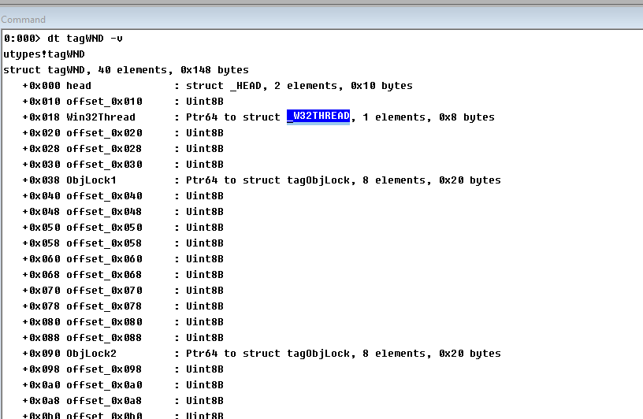

# Reverse Types.
A stupid but useful method to help reverse Windows. 

This project include header files that contain undocuments types can be compiled by both WDK , IDAPro , BinaryNinja.   

## 1. Use for develop
Just copy header files in the `include` directory.      

## 2. Use for IDAPro & Binary Ninja
Just Parse header files in the `include` directory.

## 3. Use for online debugging.
Install `ktypes.sys` at target guest virtual machine and setup a kernel debugger at host machine to debug it.   

## 4. Use for offline debugging
Start windbg at host machine and debug `utypes.exe` , it will auto break into the debugger.

Now you can use windbg to display any undocuments types.

## 6. Warning
1.If there is no special instructions, the type definition is reverse-engineered on the latest official version of Windows 10 x64.   
 
So When this types applied to other versions, some type definitions may need to be adjusted.

2. Microsoft owns the full copyright of Windows.        

Reverse engineering of these structures is only for research and learning purposes.   
      
This project does not bear any legal responsibility and I am reserves the right of final interpretation.      
   